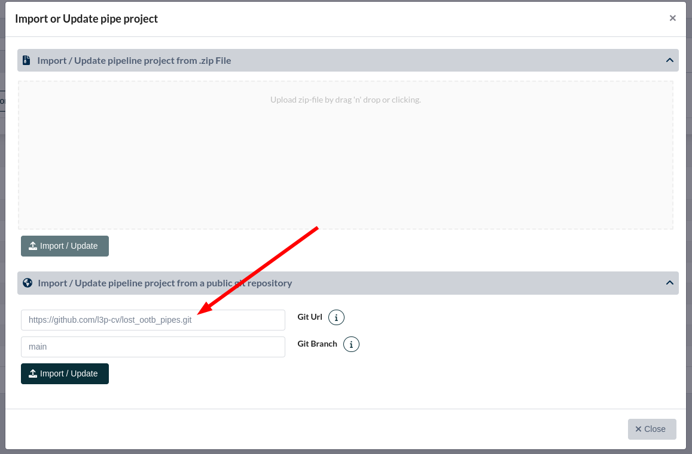

# LOST Pipeline Zoo 

Collection of pipeline projects for the web-based annotation framework LOST.

Feel free to create your own pipeline project and send us a pull request.

This repository is currently under construction.

## Zoo
### Out of the box (ootb) pipelines
* Project Name: `found`
* Repo: `https://github.com/l3p-cv/lost_ootb_pipes.git`
* Link: https://github.com/l3p-cv/lost_ootb_pipes

## How to use the pipeline zoo?
1. Log into LOST as Admin
2. Go to **Admin Area**
3. Click on the **Pipeline Projects** tab
4. Click on **Import pipeline project** button
5. Click on **Import/ Update pipeline project from a public git repository**
6. Add the url of the pipeline project you like to import
7. Click on **Import/ Update**

# Docs
Everything you need to know about creating your own pipelines is described here:
https://lost.readthedocs.io/en/latest/designers.html

All information about pipeline projects and how to import them can be found here:
https://lost.readthedocs.io/en/latest/all_about_pipelines.html
